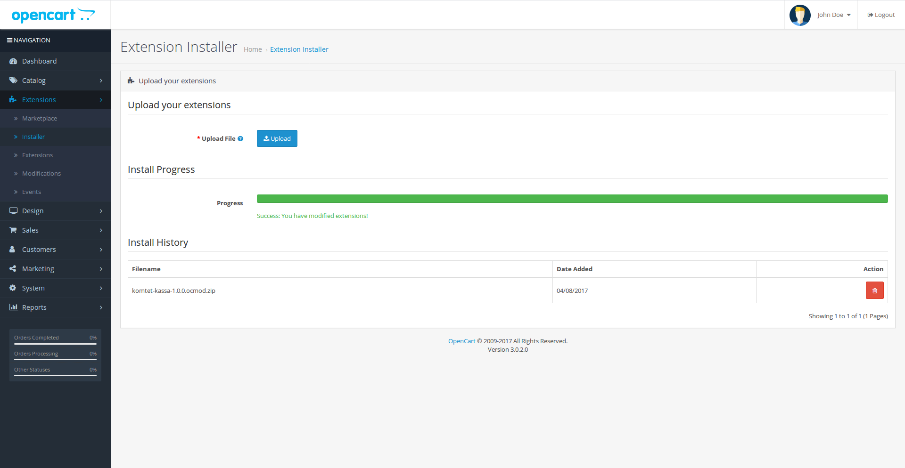
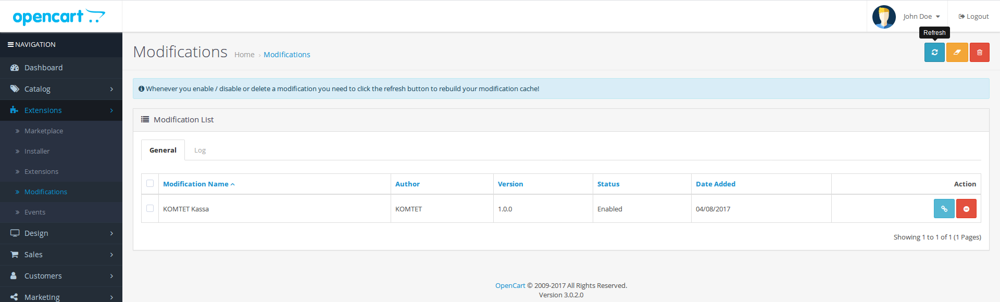
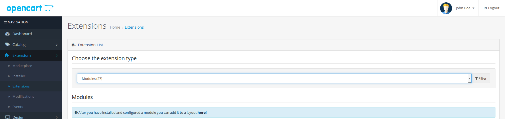
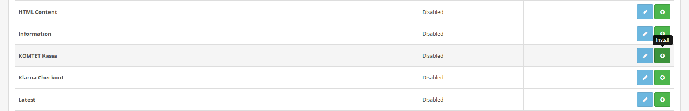
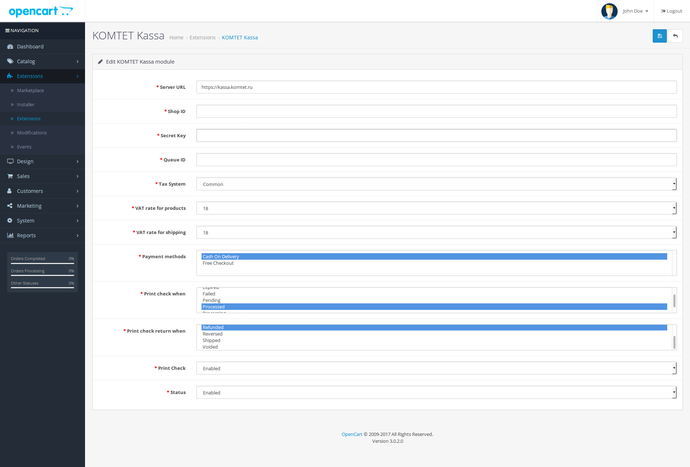
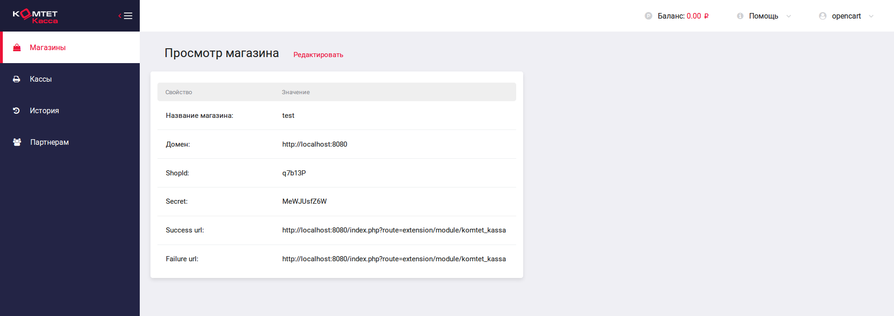
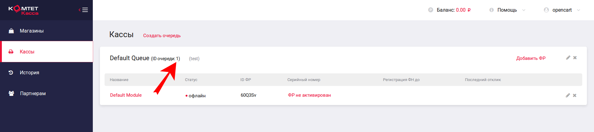
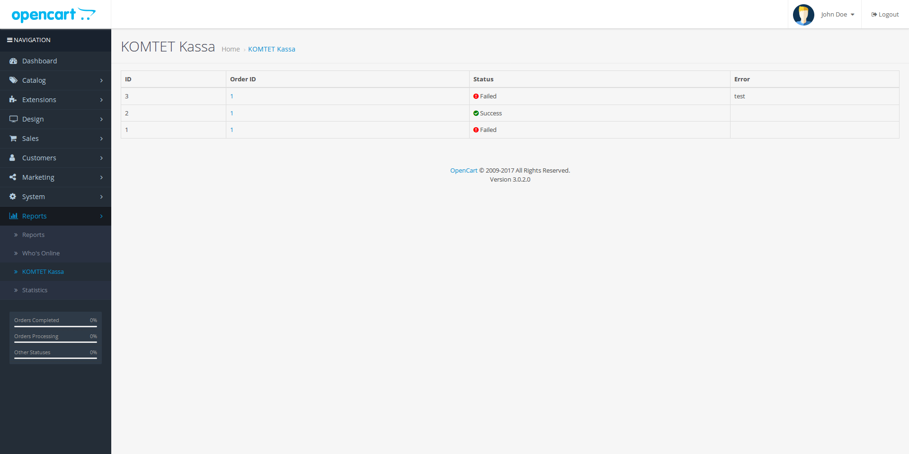

# Установка

[Скачать архив](https://github.com/Komtet/komtet-kassa-opencart/releases)

Файл должен называться `komtet-kassa-<version>.ocmod.zip`, где `<version>` &mdash; это версия модуля.

Загрузить архив:

Перейти в модификации и нажать обновить:

Затем необходимо установить и настроить модуль:

Идентификатор магазина, секретный ключ можно посмотреть здесь:

Также не забудьте в параметрах магазина на kassa.komtet.ru указать адрес сайта, Success URL и Failure URL.

Идентификатор очереди можно выбрать здесь:

Отчёт можно найти перейдя в Reports -> KOMTET Kassa (Отчёты -> КОМТЕТ Касса):

